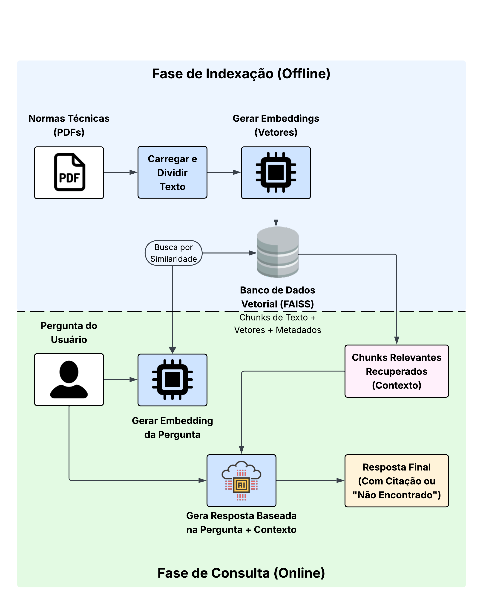

# Documentação da Arquitetura - Assistente de Normas Técnicas RAG

## Autor: Gustavo Rodrigues Ribeiro

## 1. Visão Geral

Este documento descreve a arquitetura da solução implementada para o Assistente Virtual de Consulta de Normas Técnicas, utilizando o padrão RAG (Retrieval-Augmented Generation). O objetivo é fornecer respostas precisas a perguntas em linguagem natural sobre um conjunto específico de documentos (normas técnicas), citando as fontes e indicando quando a informação não está disponível na base de conhecimento.

A arquitetura foi implementada utilizando Python e o framework LangChain.

## 2. Arquitetura RAG (Retrieval-Augmented Generation)

A arquitetura RAG combina o poder dos grandes modelos de linguagem (LLMs) para gerar texto coerente com a capacidade de recuperar informações específicas de uma base de conhecimento externa. Isso mitiga o problema de "alucinação" dos LLMs (inventar informações) e permite que o assistente baseie suas respostas em documentos confiáveis e específicos.

O fluxo de dados na arquitetura implementada é o seguinte:

**Fluxo:**

1.  **Ingestão de Dados (Offline/Setup):**
    *   **Carregamento (Loading):** Os documentos PDF contendo as normas técnicas são carregados da pasta `docs/` utilizando `DirectoryLoader` e `PyPDFLoader` do LangChain.
    *   **Divisão (Splitting):** Os documentos carregados são divididos em fragmentos menores (chunks) de texto usando `RecursiveCharacterTextSplitter`. Isso é essencial porque os LLMs têm um limite de contexto e a recuperação funciona melhor com pedaços menores e focados de informação. A sobreposição (`chunk_overlap`) garante que informações relevantes não sejam perdidas nas divisões.
    *   **Incorporação (Embedding):** Cada chunk de texto é convertido em um vetor numérico (embedding) usando um modelo de embedding (neste caso, `text-embedding-ada-002` da OpenAI ou um modelo Sentence Transformer). Embeddings capturam o significado semântico do texto.
    *   **Armazenamento (Storing):** Os vetores (embeddings) e o texto original dos chunks (junto com metadados como o nome do arquivo de origem) são armazenados em um banco de dados vetorial (`Vector Store`). Foi utilizado o FAISS, uma biblioteca eficiente para busca de similaridade em vetores, que permite salvar/carregar o índice localmente (`vectorstore/faiss_index`).

2.  **Consulta e Geração (Online/Runtime):**
    *   **Consulta do Usuário:** O usuário insere uma pergunta em linguagem natural.
    *   **Incorporação da Consulta:** A pergunta do usuário também é convertida em um vetor usando o *mesmo* modelo de embedding utilizado na ingestão.
    *   **Recuperação (Retrieval):** O vetor da consulta é usado para buscar no Vector Store (FAISS) os chunks de texto cujos embeddings são mais semanticamente similares à pergunta. O `vectorstore.as_retriever()` busca os `k` chunks mais relevantes (configurado para `k=4`).
    *   **Aumento (Augmentation):** A pergunta original do usuário e o conteúdo dos chunks recuperados (o "contexto") são combinados em um *prompt* estruturado.
    *   **Geração (Generation):** O prompt combinado é enviado para um Large Language Model (LLM) - `gpt-3.5-turbo` via `ChatOpenAI`. O LLM é instruído *explicitamente* (através do template do prompt) a:
        *   Responder à pergunta *apenas* com base no contexto fornecido.
        *   Citar o documento de origem (extraído dos metadados dos chunks recuperados).
        *   Responder exatamente "Não encontrei essa informação nas normas disponíveis." se a resposta não estiver no contexto.
    *   **Resposta Final:** A resposta gerada pelo LLM, incluindo a citação da fonte (ou a mensagem de "não encontrado"), é retornada ao usuário. O código também inclui uma lógica para garantir que a fonte seja formatada corretamente, mesmo que o LLM falhe em seguir perfeitamente a instrução de formatação da citação.

## 3. Componentes Utilizados

*   **Linguagem:** Python 3.x
*   **Framework RAG:** LangChain
*   **Carregamento de Documentos:** `DirectoryLoader`, `PyPDFLoader` (para PDFs)
*   **Divisão de Texto:** `RecursiveCharacterTextSplitter`
*   **Modelo de Embedding:** `OpenAIEmbeddings` (`text-embedding-ada-002`) / `HuggingFaceEmbeddings` (alternativa)
*   **Vector Store:** `FAISS` (para busca de similaridade e armazenamento local do índice)
*   **Modelo de Linguagem (LLM):** `ChatOpenAI` (`gpt-3.5-turbo` ou `gpt-4`)
*   **Gerenciamento de API Keys:** `python-dotenv`

## 4. Vantagens da Abordagem

*   **Precisão e Confiabilidade:** As respostas são baseadas diretamente no conteúdo das normas fornecidas, reduzindo invenções.
*   **Rastreabilidade:** A capacidade de citar a fonte exata (nome do documento) aumenta a confiança e permite verificação manual.
*   **Escalabilidade da Base de Conhecimento:** Novos documentos podem ser adicionados à pasta `docs` e o índice pode ser reconstruído ou atualizado para expandir o conhecimento do assistente.
*   **Flexibilidade:** O uso de LangChain permite trocar componentes (ex: LLM, Vector Store, Embedding Model) com relativa facilidade.
*   **Tratamento de Consultas Fora do Escopo:** O sistema é projetado para reconhecer e informar quando a informação não está presente nos documentos indexados.

## 5. Pontos de Melhoria Potenciais

*   **Extração de Metadados Mais Finos:** Extrair automaticamente números de seção ou página dos PDFs durante o carregamento para citações ainda mais precisas (pode ser complexo dependendo da estrutura do PDF).
*   **Avaliação de Relevância:** Implementar um passo para avaliar a real relevância dos chunks recuperados antes de enviá-los ao LLM.
*   **Interface de Usuário:** Desenvolver uma interface web (ex: com Streamlit ou Flask) para uma experiência mais amigável.
*   **Otimização de Custos/Performance:** Experimentar com modelos de embedding/LLM open-source locais para reduzir dependência de APIs pagas e potentially melhorar a velocidade (com hardware adequado).
*   **Tratamento de Múltiplos Índices:** Gerenciar índices separados para diferentes conjuntos de normas, se necessário.
*   **Mecanismo de Feedback:** Permitir que usuários avaliem a qualidade das respostas para refinar o sistema.